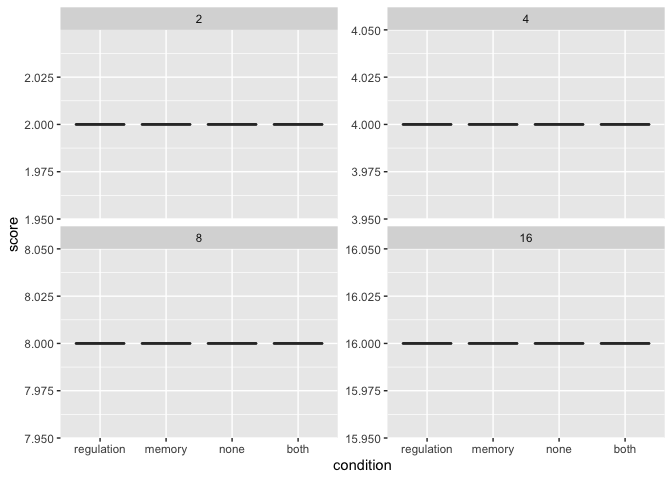
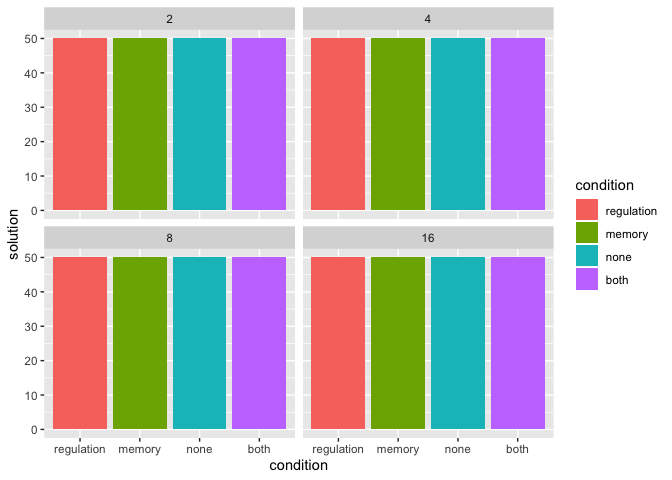

## Dependencies


```r
library(tidyr)    # (Wickham & Henry, 2018)
library(ggplot2)  # (Wickham, 2009)
library(plyr)     # (Wickham, 2011)
library(dplyr)    # (Wickham et al., 2018)
library(cowplot)  # (Wilke, 2018)
```

## Load and clean data


```r
data_loc <- "../data/chg_env_max_fit.csv"
data <- read.csv(data_loc, na.strings="NONE")

data$matchbin_thresh <- factor(data$matchbin_thresh,
                                     levels=c(0, 25, 50, 75))
data$NUM_ENV_STATES <- factor(data$NUM_ENV_STATES,
                                     levels=c(2, 4, 8, 16, 32))

get_con <- function(reg, mem) {
  if (reg == "0" && mem == "0") {
    return("none")
  } else if (reg == "0" && mem=="1") {
    return("memory")
  } else if (reg=="1"&&mem=="0") {
    return("regulation")
  } else if (reg=="1"&&mem=="1") {
    return("both")
  } else {
    return("unknown")
  }
}
data$condition <- mapply(get_con, data$USE_FUNC_REGULATION, data$USE_GLOBAL_MEMORY)
data$condition <- factor(data$condition, levels=c("regulation", "memory", "none", "both"))
```

## Task performance by condition


```r
ggplot(data, aes(x=condition, y=score)) +
  geom_boxplot() +
  facet_wrap(~ NUM_ENV_STATES, scales="free_y") +
  ggsave("dem-reg-chg-env-scores.png", width=16, height=8)
```

<!-- -->


```r
ggplot(data, aes(x=condition, y=solution, fill=condition)) +
  geom_bar(stat="identity") +
  ylim(0, 50) +
  facet_wrap(~ NUM_ENV_STATES) +
  ggsave("dem-reg-chg-env-solutions.png", width=16, height=8)
```

<!-- -->

From the above graphs, we can see that solutions evolve in every replicate of every condition. However, these are categorized as solutions based on a single (random) sequence of environmental signals.

Do all of these programs generalize to all possible sequences? Stay tuned and find out! To answer this, we added more organism analyses to the changing signal experiment to test each evolved 'solution' on a random sample of environment sequences to evaluate how well it generalizes.
